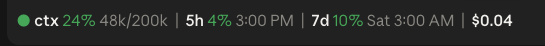

# usage-meter

A Claude Code mod that keeps your context window, usage limits, and session cost visible in a row above the prompt, so you don't have to open the usage popup to check them.



## What it shows

| Section | Means |
| --- | --- |
| `ctx` | How full the context window is, then tokens used out of the window size |
| `5h` | How much of your 5-hour limit you've used, then when it resets |
| `7d` | How much of your weekly limit you've used, then when it resets |
| `$` | What this session has cost so far |

These are the same figures the status line and the usage popup show.

- **Colors:** each percentage is green, turns yellow at 70%, and red at 90%. The dot at the start follows the context percentage.
- **Reset times** are in your local time. A reset within the next 20 hours shows the time only; a later one adds the weekday.
- **Limits** only show on a Claude subscription, after the first reply reports them. Any other limit Claude Code reports (a gateway spend limit, for example) gets its own section, labeled with its raw name.

## Install

Run these in Claude Code:

```
/plugin marketplace add dblanken-yale/usage-meter
/plugin install usage-meter@usage-meter
```

Or from a terminal:

```bash
claude plugin marketplace add dblanken-yale/usage-meter
```

```bash
claude plugin install usage-meter@usage-meter
```

Start a new Claude Code session, in the terminal or the desktop app.

## Update

Turn on auto-update for the `usage-meter` marketplace in `/plugin` (Marketplaces tab), and new versions install when Claude Code starts. To update by hand:

```bash
claude plugin marketplace update usage-meter
```

Desktop app sessions pick up the new version when you start a new one.

## Develop

Clone the repo and load it from the folder, so edits reload as you save:

```bash
git clone git@github.com:dblanken-yale/usage-meter.git ~/code/usage-meter
```

```bash
claude --plugin-dir ~/code/usage-meter
```

Disable the marketplace install while you do this, or it loads twice.

Bump `version` in `.claude-plugin/plugin.json` with every release. Installed copies only update when the version changes.

## Notes

- It shares the row above the prompt with other mods. It calls `next(e)` and stacks whatever the mods beneath drew under its own row. A mod above it that returns only its own row hides it; [cache-buster](https://github.com/dblanken-yale/cache-buster) stacks the same way, so the two show together. In the desktop app there's a little space between the rows; the terminal gets none, since one step of padding there is a whole blank line.
- To check it after editing: `claude plugin validate ~/code/usage-meter` and `claude plugin test ~/code/usage-meter`.
- `tsconfig.json` points at `.claude-plugin/types/`, which Claude Code generates and git ignores, so type-checking a fresh clone needs those files regenerated first.
